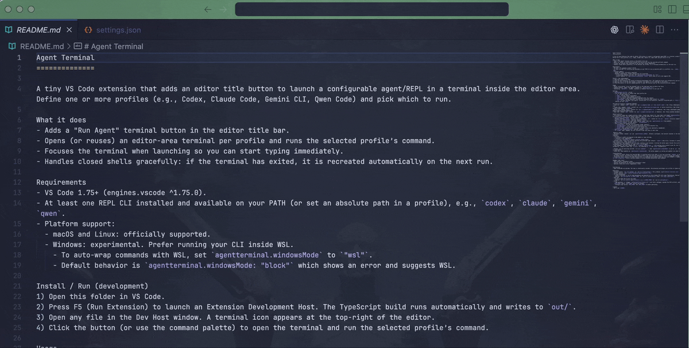
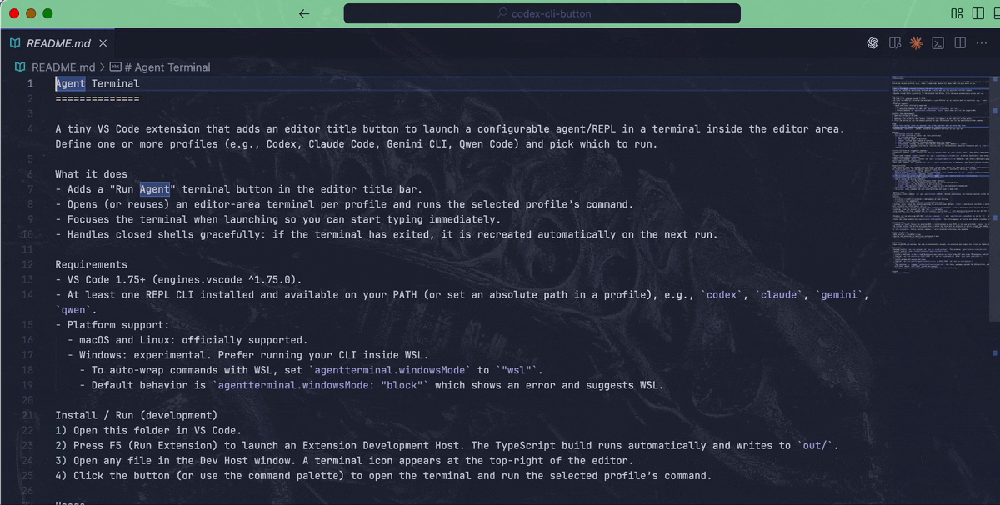
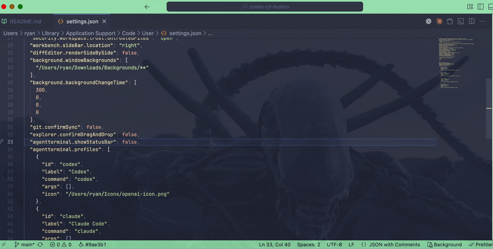

Agent Terminal
==============

Run Agents in the Editor Terminal.

- Launch your favorite agent/REPL in an editor‑area terminal.
- Pick a profile and go. No duplicate sends — the terminal is reused.

Screenshots
-----------





Features
--------

- Editor button + keybinding to launch.
- Reuses the same terminal; no duplicate commands are sent.
- QuickPick between multiple profiles (Codex, Claude Code, Gemini, Qwen).
- Smart cwd modes: workspace root, active workspace/file dir, or prompt.
- Optional status bar action.
- Windows: WSL wrapper or block with guidance.

Quick start
-----------

1) Install the extension.
2) Open a file and click the terminal icon (or run `Agent: Run Agent`).
3) If prompted, add a profile in settings.

Customize
---------

Add or tweak profiles and behavior in settings.json:

```
{
  "agentterminal.profiles": [
    { "id": "codex", "label": "Codex", "command": "codex", "args": ["-p", "brain"] },
    { "id": "claude", "label": "Claude Code", "command": "claude" }
  ],
  "agentterminal.cwdMode": "workspaceRoot",      // workspaceRoot | activeWorkspace | activeFileDir | prompt
  "agentterminal.rememberSelection": true,        // remember pick in prompt mode
  "agentterminal.showStatusBar": false,           // adds an "Agent" status bar button
  "agentterminal.windowsMode": "block"            // block | wsl | native
}
```

Tips
----

- Put flags in `args`, e.g., `"args": ["-p", "profile"]`.
- Use `terminalName` to control the reusable terminal’s name.
- Set an icon via codicon (e.g., `"$(zap)"`) or an image path.

Requirements
- VS Code 1.75+ (engines.vscode ^1.75.0).
- At least one REPL CLI installed and available on your PATH (or set an absolute path in a profile), e.g., `codex`, `claude`, `gemini`, `qwen`.
- Platform support:
  - macOS and Linux: officially supported.
  - Windows: experimental. Prefer running your CLI inside WSL.
    - To auto-wrap commands with WSL, set `agentterminal.windowsMode` to `"wsl"`.
    - Default behavior is `agentterminal.windowsMode: "block"` which shows an error and suggests WSL.

Install / Run (development)
1) Open this folder in VS Code.
2) Press F5 (Run Extension) to launch an Extension Development Host. The TypeScript build runs automatically and writes to `out/`.
3) Open any file in the Dev Host window. A terminal icon appears at the top‑right of the editor.
4) Click the button (or use the command palette) to open the terminal and run the selected profile’s command.

Usage
- Editor title button: click the terminal icon in the top‑right when an editor has focus.
- Command Palette: "Agent: Run Agent" (command id: `agentterminal.run`).
- Keybinding: `Cmd+Shift+.` (macOS). Customize in Keyboard Shortcuts to suit your OS.

Settings
- `agentterminal.profiles` (array)
  - List of REPL profiles to choose from. Each profile has:
    - `id` (string) unique id
    - `label` (string) shown in QuickPick
    - `command` (string) base command to execute
    - `args` (string[], optional) arguments appended after the command
    - `terminalName` (string, optional) override the terminal’s name; default is `<label>`
    - `icon` (string, optional) icon source: relative path (to the extension), absolute filesystem path, a `file:///...` URI, or a codicon id like `$(zap)`

Verified CLI binaries (suggested commands)
- Codex CLI: command `codex` (install via `npm i -g @openai/codex` or `brew install codex`). See: https://developers.openai.com/codex/cli/
- Claude Code: command `claude` (install via `npm i -g @anthropic-ai/claude-code` or native installers). See: https://docs.anthropic.com/en/docs/claude-code/cli-reference
- Gemini CLI: command `gemini` (install via `npm i -g @google/gemini-cli` or Homebrew). See: https://developers.google.com/gemini-code-assist/docs/gemini-cli
- Qwen Code: command `qwen` (install via `npm i -g @qwen-code/qwen-code` or Homebrew). See: https://github.com/QwenLM/qwen-code

Default profiles
- The extension seeds four example profiles (Codex, Claude Code, Gemini CLI, Qwen Code) with simple `media/profile-*.svg` icons so tabs are visually distinct. You can replace these with your own assets or use codicon ids (e.g., `$(flame)`).
- `agentterminal.windowsMode` (string, default: `"block"`)
  - Windows handling. `block`: show an error (recommended). `wsl`: invoke via `wsl.exe`. `native`: run as-is (experimental).
- `agentterminal.showStatusBar` (boolean, default: `false`)
  - Show a status bar action (right side) labeled "Agent" that runs `agentterminal.run` from anywhere.
- `agentterminal.cwdMode` (string, default: `"workspaceRoot"`)
  - How to choose the working directory:
    - `workspaceRoot`: use the first workspace folder (default).
    - `activeWorkspace`: use the workspace containing the active editor’s file.
    - `activeFileDir`: use the directory of the active file.
    - `prompt`: when multiple folders are open, prompt to pick one (optionally remembered).
- `agentterminal.rememberSelection` (boolean, default: `true`)
  - In `prompt` mode, remember the last selected folder and reuse it next time.

 Behavior notes
- Workspace folder: chooses `cwd` per `agentterminal.cwdMode`. Without a workspace, the terminal launches in the shell’s default location.
- Profiles:
  - 0 profiles → you’ll be prompted to add samples or open settings.
  - 1 profile → runs immediately.
  - >1 profiles → QuickPick to choose a profile (always shown).
- Terminal reuse: reuses the terminal matching the profile’s name (default `<label>`) when alive; recreates it automatically if the shell exited (e.g., after typing `exit`).
- Send behavior: the command is sent only when creating a new terminal; clicking the button again focuses the existing terminal without re-sending. Close the terminal (or type `exit`) to run again.
- Args assembly: the final command sent is `<command> <quoted args...>` with quoting rules suited to your OS. Put flags in `args` for reliability. Composite items like `-p brain` are tokenized to `-p` and `brain` automatically.
 
- Windows: you can auto-wrap with WSL (`wsl.exe <command> ...`) when `agentterminal.windowsMode` is set to `wsl`. Native Windows support is experimental.
- Status bar: when enabled via `agentterminal.showStatusBar`, the button appears on startup and updates live when toggling the setting.

Troubleshooting
- "command not found": Ensure the selected REPL is installed and on your PATH, or set your profile’s `command` to an absolute path.
- No toolbar button: The button only shows when an editor has focus and the extension is active (invoke the command once if needed).
- Integration tests require a VS Code Electron host; in sandboxed environments these may fail with SIGABRT or sandbox errors. Run `npm run test:integration` locally (outside sandbox) or allow elevated permissions when prompted.

Roadmap (high level)
- REPL profiles + QuickPick — done.
- Smarter cwd selection for multi‑root workspaces — done.
- Optional status bar action (toggleable) — done.
 

Contributing
- Open issues/PRs are welcome. The code is intentionally minimal; the extension and helpers are written in TypeScript (`src/*.ts`).

Publishing
- Package locally: `npx vsce package` (or `npm run vscode:package`). This produces `agent-terminal-<version>.vsix`.
- Install locally: `code --install-extension agent-terminal-*.vsix`.
- VS Code Marketplace:
  - Create a Publisher in the VS Code Marketplace and generate an Azure DevOps PAT with scope "Marketplace: Publish".
  - Publish: `npx vsce publish -p $VSCE_TOKEN` (or `npm run vscode:publish` after `vsce login <publisher>`).
- Open VSX:
  - Create an Open VSX account and token.
  - Publish: `npx ovsx publish agent-terminal-*.vsix -p $OVSX_TOKEN` (or `npm run ovsx:publish`).
- CI/CD:
  - Tags matching `v*` trigger `.github/workflows/release.yml`: runs tests, packages, uploads the VSIX artifact, and publishes when `VSCE_TOKEN` and/or `OVSX_TOKEN` secrets are present.
  - Configure repo secrets `VSCE_TOKEN` and `OVSX_TOKEN` to enable publishing.

License
- MIT — see `LICENSE`.
